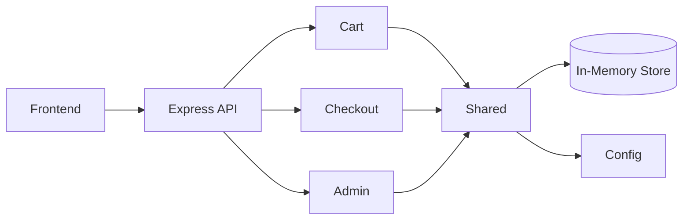
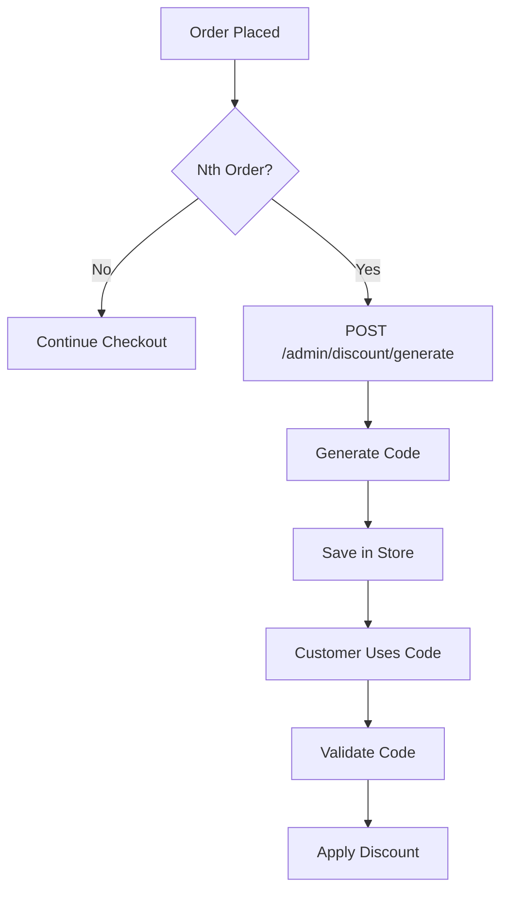
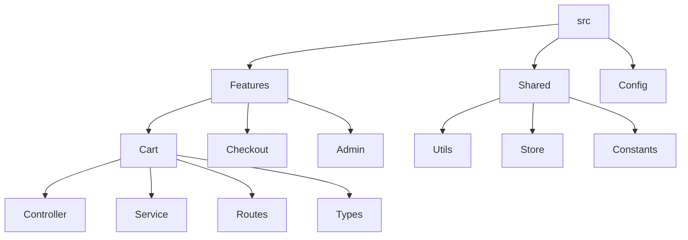
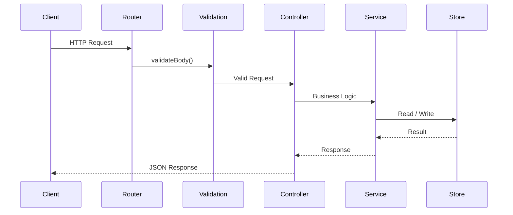

# Architecture and Design Decisions

This document explains the architecture, coding conventions, and the main design decisions made during the implementation of this project.

---

# 1. Architecture: Feature-Sliced Design (FSD)

The project follows **Feature-Sliced Design (FSD)** for both the frontend and backend. Code is grouped by feature instead of technical layers so that each feature owns its routes, services, types, and related logic.

## Why FSD?

- Feature code stays together.
- Easier to navigate as the project grows.
- Shared utilities remain isolated from business logic.

## Layer Rules

| Layer | Backend | Frontend | Purpose |
|---|---|---|---|
| Features | `src/features/<name>/` | `src/features/<name>/` | Business logic |
| Shared | `src/shared/` | `src/shared/` | Common utilities |
| Config | `src/config/` | — | Application configuration |

A feature can import from `shared` and `config`. Features should not import directly from other features.

## High-Level Architecture

---

# 2. Design Decisions

## Decision 1: In-Memory Singleton Store

**Context**

The assignment does not require a database, but all services need access to the same application state.

**Options Considered**

- Option A: Export plain objects.
- Option B: Singleton class.
- Option C: External in-memory database.

**Choice**

Singleton class.

**Why**

A Singleton provides one access point for reading and updating data. Services interact through methods instead of modifying state directly. This also makes testing easier with `resetForTesting()` and keeps replacing the implementation with a database straightforward later.

---

## Decision 2: Admin-Triggered Discount Generation

**Context**

The requirements mention every nth order is eligible for a discount and also provide an admin endpoint for generating discounts.

**Options Considered**

- Option A: Generate automatically during checkout.
- Option B: Generate through the admin endpoint.

**Choice**

Admin endpoint.

**Why**

Checkout is responsible only for validating discount codes. Generation is handled by the admin endpoint after eligibility is verified. This keeps checkout logic simple and matches the provided API design.

### Discount Flow

---

## Decision 3: Feature-Sliced Design

**Context**

The project contains multiple independent features.

**Options Considered**

- Option A: MVC.
- Option B: Feature-Sliced Design.

**Choice**

Feature-Sliced Design.

**Why**

Keeping controllers, services and types together inside a feature makes navigation easier. Shared code is moved into `shared` instead of creating dependencies between features.

### Feature Structure

---

## Decision 4: Runtime Validation Using Zod

**Context**

TypeScript does not validate request payloads at runtime.

**Options Considered**

- Option A: Manual validation.
- Option B: Zod schemas.

**Choice**

Zod.

**Why**

Schemas validate requests before controllers execute and also provide TypeScript types through `z.infer`. Validation logic stays in one place.

### Request Flow

---

## Decision 5: Environment-Based Configuration

**Context**

Business values such as discount percentage and nth-order threshold may change.

**Options Considered**

- Option A: Hardcode values.
- Option B: Environment variables.

**Choice**

Environment variables through `src/config`.

**Why**

Business configuration is separated from application logic and can be updated without code changes.

---

## Decision 6: UUID + Sequential Order Number

**Context**

Orders require both an internal identifier and a customer-friendly reference.

**Options Considered**

- Option A: UUID only.
- Option B: Sequential number only.
- Option C: UUID with sequential order number.

**Choice**

UUID with sequential order number.

**Why**

UUID is suitable for internal use and public APIs. Sequential numbers are easier for users and support staff to reference. The sequential number is also used for nth-order discount eligibility.

---

## Decision 7: Discount Code Format

**Context**

Generated discount codes should be easy to read and have a low chance of collision.

**Options Considered**

- Option A: Sequential codes.
- Option B: Random codes using `crypto`.

**Choice**

`DISC-XXXX-XXXX` generated with `crypto.randomBytes()`.

**Why**

The format is readable while providing enough randomness for this assignment.

---

# 3. Coding Practices

## File Naming

| Type | Pattern |
|---|---|
| Service | `<feature>.service.ts` |
| Controller | `<feature>.controller.ts` |
| Routes | `<feature>.routes.ts` |
| Types | `<feature>.types.ts` |
| Test | `<feature>.test.ts` |

## API Responses

Controllers use the shared `sendSuccess()` and `sendError()` helpers instead of calling `res.json()` directly.

## Error Handling

- Expected errors use `createError()`.
- Unexpected errors are handled by the global error handler.
- Controllers are wrapped with `asyncHandler()`.

## Validation

Validation is performed with Zod schemas in each feature.

## Constants

Common messages and values are stored in `src/constants`.

## Store Access

Controllers call services, and services interact with the Singleton store.

## Configuration

Environment values are accessed only through `src/config`.

## Testing

- Tests reset the store before each run.
- Tests execute serially because the store is shared.
- External dependencies are not mocked.
